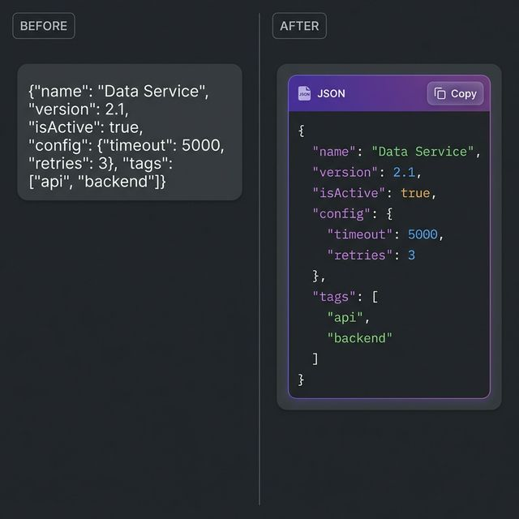
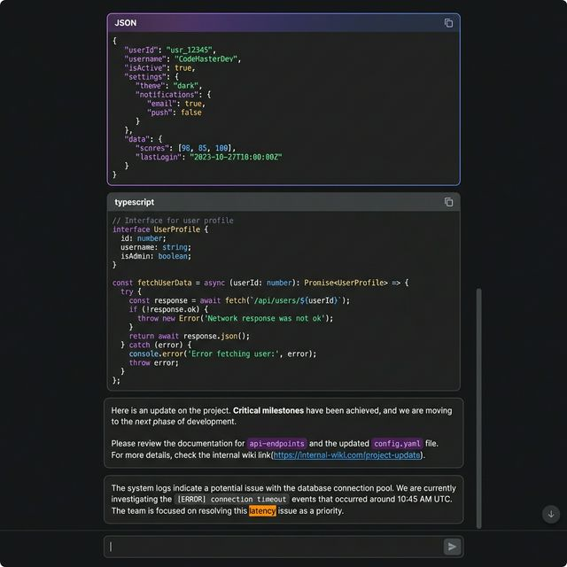

# Enhanced Message Display - Implementation Summary

## Overview
I've significantly improved the visual display of message content in your Claude Code Search History app. The messages now feature **intelligent content detection** with **beautiful syntax highlighting** for JSON, code blocks, and markdown.

## Key Improvements

### 1. **Automatic Content Type Detection**
The new `MessageContent` component automatically detects and formats:
- ✅ **JSON data** - Like your MCP server configuration
- ✅ **Markdown code blocks** - With language-specific highlighting
- ✅ **Inline code** - Formatted with purple backgrounds
- ✅ **Plain text** - With markdown formatting (bold, italic, links)
- ✅ **Mixed content** - Intelligently splits and formats each section

### 2. **Syntax Highlighting**

#### JSON Highlighting
- **Keys**: Purple (`#8b5cf6`) with medium weight
- **Strings**: Green (`#34d399`)
- **Numbers**: Blue (`#60a5fa`)
- **Booleans**: Amber (`#f59e0b`) with bold weight
- **Null values**: Red (`#ef4444`) with italic style

#### Code Highlighting
- **Keywords**: Purple (`#c084fc`) - `const`, `function`, `class`, etc.
- **Strings**: Emerald (`#6ee7b7`)
- **Comments**: Gray (`#6b7280`) with italic style
- **Booleans**: Amber (`#fbbf24`)

### 3. **Interactive Features**

#### JSON Blocks
- 🎨 **Purple gradient header** with "JSON" label
- 📋 **Copy button** (appears on hover)
- 🔽 **Collapse/Expand** functionality for large JSON
- 📏 **Max height** with scroll for readability
- 🎯 **Special border styling** with purple accent

#### Code Blocks
- 🏷️ **Language label** in header
- 📋 **Copy button** (appears on hover)
- 🎨 **Syntax highlighting** based on detected language
- 💻 **Monospace font** (SF Mono, Monaco, Cascadia Code, etc.)

#### Inline Code
- 💜 **Purple background** with subtle border
- 🔤 **Monospace font**
- ✨ **Subtle padding** for better readability

### 4. **Enhanced Text Formatting**
- **URLs**: Auto-converted to clickable links (blue with hover effect)
- **Bold text**: `**text**` → Bold with lighter color
- **Italic text**: `*text*` → Italic styling
- **Inline code**: `` `code` `` → Purple badge style

### 5. **Search Query Highlighting**
- Query matches are still highlighted with the orange accent
- Works seamlessly with all content types
- Preserved from the original implementation

## Files Modified

### New Files
1. **`src/renderer/src/components/MessageContent.tsx`**
   - Smart content parser and renderer
   - Syntax highlighting logic
   - Interactive code/JSON blocks

### Updated Files
1. **`src/renderer/src/components/ConversationView.tsx`**
   - Integrated MessageContent component
   - Removed old highlighting logic
   - Cleaner, more maintainable code

2. **`src/renderer/src/styles/globals.css`**
   - Added comprehensive syntax highlighting styles
   - JSON-specific color tokens
   - Code block styling
   - Inline code styling

## Visual Comparison

### Before vs After
**Before**: Plain text with basic HTML escaping  
**After**: Rich, syntax-highlighted content with interactive elements



### Content Types Showcase
The new message renderer supports multiple content types with beautiful formatting:



**Supported Content Types:**
1. **JSON Blocks** - Purple gradient header, syntax highlighting, collapsible
2. **Code Blocks** - Language-specific highlighting with copy button
3. **Markdown Text** - Bold, italic, inline code, clickable links
4. **Plain Text** - With search query highlighting

## Technical Details

### Content Detection Logic
1. **JSON Detection**: Checks if content starts with `{` or `[` and is valid JSON
2. **Code Block Detection**: Regex pattern for markdown code fences (` ```language `)
3. **Code Heuristics**: Analyzes patterns like indentation, braces, keywords
4. **Language Detection**: Auto-detects JavaScript, TypeScript, Python, Go, etc.

### Performance Optimizations
- Uses `useMemo` for expensive parsing operations
- Efficient regex patterns
- Minimal re-renders with React best practices

### Security
- All user content is properly escaped via `escapeHtml()`
- Safe HTML injection only for highlighted syntax
- No XSS vulnerabilities

## Usage Example

Your `msg1.md` file containing MCP server configuration will now display as:
- Beautiful JSON block with purple gradient header
- Syntax-highlighted keys, values, and data types
- Collapsible for large configurations
- Copy button for easy sharing
- Proper indentation and formatting

## Next Steps (Optional Enhancements)

If you'd like to further improve the message display, consider:
1. **Line numbers** for code blocks
2. **More language support** (Rust, Java, C++, etc.)
3. **Diff highlighting** for code changes
4. **Table rendering** for markdown tables
5. **Image embedding** for image URLs
6. **LaTeX rendering** for mathematical expressions

---

**Status**: ✅ Complete and ready to use!

The dev server should automatically reload with these changes. Open a conversation with JSON or code content to see the improvements in action!
